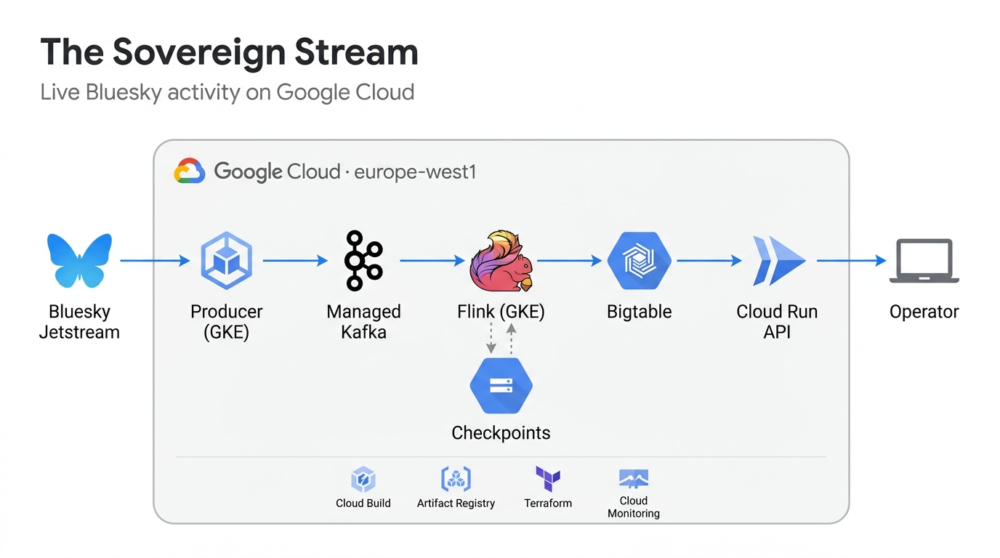

# The Sovereign Stream

A streaming pipeline on Google Cloud that followed every Bluesky post, like and
repost live, and kept each one's current state correct through duplicates,
replays and crashes.

Bluesky publishes everything that happens on it as a public live feed called
Jetstream. This pipeline read the posts, likes and reposts from it, a few
hundred a second, and could say for any of them at any moment whether it still
existed, which revision was newest and which post a like pointed to.

A dropped connection makes Jetstream send messages again, and a job restarting
from a checkpoint replays events it already wrote, after newer ones. None of
that could move a record back in time. Flink drops revisions it has already
passed on, and Bigtable takes a write only when its revision is newer than the
stored one, a check made on the server itself.

## Demo

> [!NOTE]
> The cloud project has been offline since its free trial ended on
> 21 September 2026. This recording is the system running live.

https://github.com/user-attachments/assets/68be3690-6560-4570-825d-0b2c777a329e

Recorded in the Google Cloud Console on 19 and 20 September 2026. In order:
Cloud Build, the producer's live log, Managed Kafka, the Flink job and its
checkpoints, the dashboard, Bigtable, Cloud Run and Cloud Monitoring. The
original file is attached to the
[v1.0.0 release](https://github.com/ReguiguiMohamed/The-Sovereign-Stream/releases/tag/v1.0.0).

## How it works

1. **The producer**, a Java process on GKE, holds one WebSocket to Jetstream,
   drops post text and media, and writes each batch to Kafka in a single
   transaction. Its resume point never gets ahead of what Kafka safely holds.
2. **Managed Kafka** keeps three days of events on one partition.
3. **Flink** on GKE groups events by record and passes on only revisions newer
   than the last one it saw. It checkpoints to Cloud Storage every 30 seconds.
4. **Bigtable** holds one row per record. The server applies a write only if its
   revision is newer than the stored one.
5. **Cloud Run** serves a small read API and a live dashboard. It is private, so
   only callers with IAM access get through.

Terraform defines the infrastructure, and Cloud Build ran all of it: tests,
images, plans, deploys, and a teardown build that checked the deadline every 15
minutes.

## Results

| Check | Result |
| --- | --- |
| Live window | 18 to 21 September 2026, `europe-west1` |
| Events read | 18,766,837 by 19 September at 15:40 UTC, none quarantined |
| Throughput | about 330 records a second, the live Bluesky rate at the time |
| Freshness | newest record on the dashboard under 200 ms old once caught up |
| [Crash recovery](deploy/README.md#acceptance) | TaskManager deleted mid-stream, job back from checkpoint 826, 7,222 records written after |
| Private API | a call without a token gets 403 |
| [One record, end to end](deploy/README.md#acceptance) | a like followed from Jetstream to the API, then confirmed against Bluesky's own API |
| [Tests](streaming/README.md#tests) | 34, plus 11 bugs put back on purpose, [each one caught](https://github.com/ReguiguiMohamed/The-Sovereign-Stream/actions/runs/35784341235) |
| [Estimated cost](docs/cost-estimate.md) | USD 0.64 to 0.86 an hour, mostly Kafka |

## Repository

Code, images and cloud resources use the name `eventproof`.

| Path | Contents |
| --- | --- |
| [`streaming/`](streaming/) | the producer, the Flink job, the query API and dashboard, and their tests |
| [`contracts/`](contracts/) | JSON Schema for the one event format every part shares |
| [`infra/`](infra/) | Terraform, the owner IAM script, the scheduled teardown |
| [`deploy/`](deploy/) | Kubernetes workloads and the acceptance check |
| [`tools/`](tools/) | packaged-image smoke test, mutation check, Jetstream sampler |
| [`docs/`](docs/) | cost estimate and images |
| [`cloudbuild.yaml`](cloudbuild.yaml) | tests, both images and the smoke test, in Cloud Build |

## Built with

Java 17, Apache Flink 2.2.1, Flink Kubernetes Operator 1.15, Google Cloud
Managed Service for Apache Kafka, GKE, Bigtable, Cloud Run, Cloud Storage, Cloud
Monitoring, Cloud Scheduler, Terraform 1.16 and Cloud Build.

## Data

Public Bluesky data from the free Jetstream endpoint, used under Bluesky's
[developer guidelines](https://bsky.network/docs/developer-guidelines/). The
producer kept identifiers, revisions, timestamps and the post each like or
repost points to. Post text and media were dropped before anything was stored.

## License

[MIT](LICENSE). Built by [Mohamed Reguigui](https://github.com/ReguiguiMohamed).
