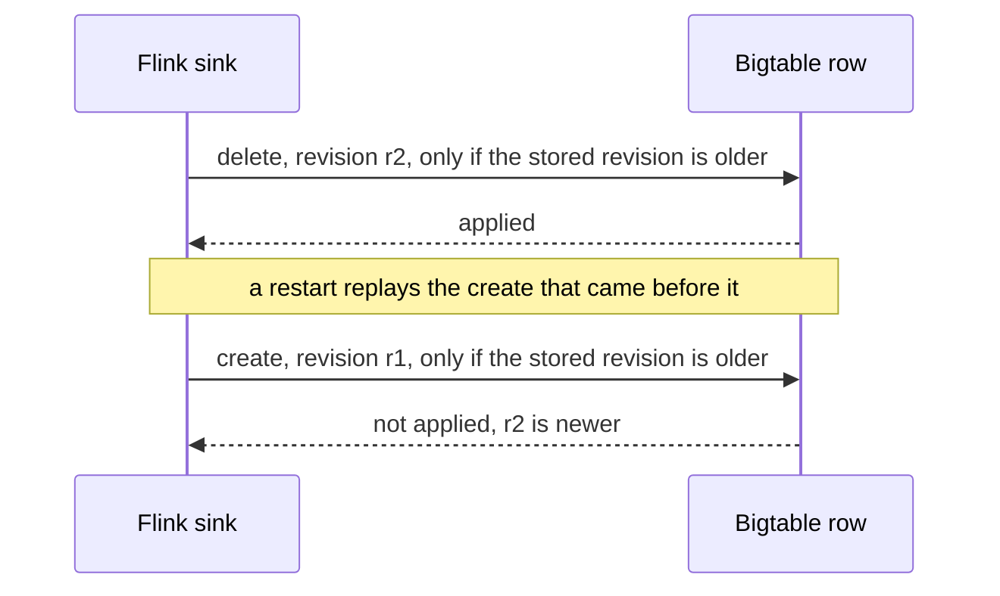

# Streaming

All the Java lives here, in one Maven module on Java 17 and Flink 2.2.1. It
builds a single shaded jar with three entry points, packed into two images by
the [Dockerfile](Dockerfile).

| Entry point | Runs on | What it does |
| --- | --- | --- |
| [`JetstreamProducer`](src/main/java/dev/eventproof/streaming/JetstreamProducer.java) | GKE | Reads Bluesky Jetstream v2 and writes `record-state.v1` events to Kafka in transactions |
| [`CurrentStateJob`](src/main/java/dev/eventproof/streaming/CurrentStateJob.java) | Flink on GKE | Kafka topic to newest revision per record to Bigtable |
| [`CurrentStateApi`](src/main/java/dev/eventproof/streaming/CurrentStateApi.java) | Cloud Run | Read API, plus the live dashboard at `/` |

The `flink-job` image is the official Flink image with the jar and the Cloud
Storage filesystem plugin for checkpoints. The `service` image is a Temurin 17
JRE that runs the producer or the API, whichever class the container is given.
Flink stays on 2.2.1 because the Flink Kubernetes Operator 1.15.0 supports up to
2.2.x.

## The event

Every component speaks one format,
[`record-state.v1`](../contracts/record-state.v1.schema.json). An event is one
revision of one Bluesky record, or a marker for a whole account.

| Field | Record | Account marker |
| --- | --- | --- |
| `entity_type` | the collection: `app.bsky.feed.post`, `.like` or `.repost` | `account` or `sync` |
| `entity_id` | `did/rkey` | `did` |
| `event_type` | `create`, `update` or `delete` | same as `entity_type` |
| `state` | `active`, or `deleted` after a delete | `active`, the account status, or `resynced` |
| `revision` | `rev`, the commit's TID | the zero-padded `source_seq` |
| `source_seq` | Jetstream `seq`, also the resume cursor | same |
| `subject` | the post a like or repost points to, otherwise null | null |
| `event_id` | SHA-256 of type, id, revision and event type | same |

Post text and media are dropped at the producer. Identity events change no
record, so they are counted and skipped, while a message that fails validation
goes to the quarantine topic with the reason in a Kafka header.

## Ordering

Flink state and the Bigtable row share one key,
`escape(entity_type)#escape(entity_id)`. Escaping turns `%` into `%25` and `#`
into `%23`, which leaves exactly one raw `#` as the separator, so two different
records can never share a key.

Flink remembers the last revision it passed on for each record and drops
anything that doesn't sort after it. That removes most repeated writes.
Correctness lives one step later, in Bigtable.

A Bigtable cell timestamp stops at milliseconds. A Bluesky revision is a TID,
which carries microseconds and a clock id, so two revisions of one record can
land in the same millisecond. Timestamps can't order them. Each write is a
check-and-mutate instead: the server compares the stored `revision` with the
incoming one and applies the write only when the incoming one is greater.
Revisions are fixed-width strings, so byte order is time order.

Same-millisecond revisions, retried batches and a replay into empty Flink state
all end on the newest revision. Writing the same revision twice changes nothing.
Because the server settles every write, the sink keeps up to 256 of them in
flight at once. Flink waits for all of them at each checkpoint, so a checkpoint
never covers an update that hasn't landed.

## Accounts

An account event with `active: false` and `status: deleted`, or any sync event,
purges that account's earlier records. The account row's purge boundary rises to
the event's sequence, then every record row of the account at or below it is
deleted, each delete conditional on the same comparison, so records written
later survive. Reads check the account row too. A record stays hidden while its
account is inactive, and after a purge, even if a replay writes it again.

## Producer

- One Kafka transaction per batch of up to 2,000 messages. The batch commits
  only after every send in it succeeded, so a failed send can't be overtaken by
  a later one.
- The resume cursor is the highest committed sequence, read back from the record
  topic with `read_committed` on start. Jetstream's cursor is inclusive, so the
  boundary event arrives again and Flink drops it by its revision.
- A fixed transactional id fences any older instance. Any Kafka error ends the
  process, and the restart resumes from the committed cursor.
- It alternates between the us-east and us-west Jetstream instances when it
  reconnects, and gives up once ten retries fail in a row.
- It logs one JSON line a minute: received, published, identity skipped,
  quarantined, cursor.

## Query API

| Request | Answer |
| --- | --- |
| `GET /v1/current-state?entity_type=&entity_id=` | `200` with the stored event, or `404` when it is absent, purged or its account is inactive |
| `GET /v1/activity?limit=` | the records changed in the last hour, newest first, 50 by default and 200 at most |
| `GET /` | the dashboard, which reads the two endpoints above |
| missing, blank or repeated parameter | `400 {"error":"invalid_request"}` |
| any method other than `GET` | `405` with `Allow: GET` |

A lookup reads at most two rows, the record and its account. The activity list
reads index rows whose keys hold the complement of the receive time, so a plain
prefix read comes back newest first, then does one point read per record. No
request scans the table. The index lives in the `act` column family, which
expires cells after an hour, and reads apply the same hour because Bigtable
collects garbage lazily.

The server runs 16 workers to match the Cloud Run concurrency setting, stops
cleanly on SIGTERM, and has no login of its own, because Cloud Run IAM decides
who gets in.

## Tests

`mvn --file streaming/pom.xml verify` runs 34 tests on JDK 17. The Bigtable
tests use Google's emulator, which the test dependency bundles, and the Kafka
tests use the client's mocks, so nothing needs Docker or a cloud account.

| Guarantee | Tests |
| --- | --- |
| A redelivered revision is applied once | `CurrentStateJobTest.redeliveredRevisionProducesOneUpdate` |
| An older revision never replaces a newer one | `CurrentStateJobTest.olderRevisionArrivingLastCannotReplaceNewer`, `BigtableCurrentStateTest.sameMillisecondOlderRevisionWrittenLastIsIgnored`, `concurrentAndRetriedWritesKeepTheNewest`, `replayWithEmptyFlinkStateKeepsTheNewest` |
| A deleted record stays deleted | `CurrentStateJobTest.deleteAfterCreateBecomesCurrent`, `BigtableCurrentStateTest.staleCreateAfterDeleteIsIgnored` |
| The same id under two types is two records | `CurrentStateJobTest.sameIdUnderAnotherTypeIsAnotherRecord`, `rowKeySeparatorCannotCollideAcrossEntityTypeAndId` |
| A deleted account's records are purged, an inactive account's are hidden | `BigtableCurrentStateTest.accountDeletionPurgesEarlierRecordsAndHidesTheRest`, `syncPurgesEarlierRecordsOnlyAndAnOlderPurgeCannotLowerIt`, `CurrentStateApiTest.anInactiveAccountHidesItsRecordsUntilReactivated` |
| The resume cursor never passes an unpublished message | `TransactionalPublisherTest.anEarlierFailedSendBlocksTheCommitEvenIfLaterSendsSucceed`, `aFailedCommitLeavesTheCursorWhereItWas`, `malformedMessagesAreQuarantinedInTheSameTransaction`, `restartResumesFromTheHighestCommittedSequence` |
| Keyed state survives a restart | `SavepointRecoveryTest.keyedStateSurvivesStopWithSavepoint` |

The rest cover the Jetstream mapping, contract validation, the HTTP contract and
the dashboard.

[`tools/discrimination-check.sh`](../tools/discrimination-check.sh) puts 11 of
these bugs back, one at a time, and requires the named tests to fail with an
assertion each time. A build error or a crash doesn't count as a catch.
